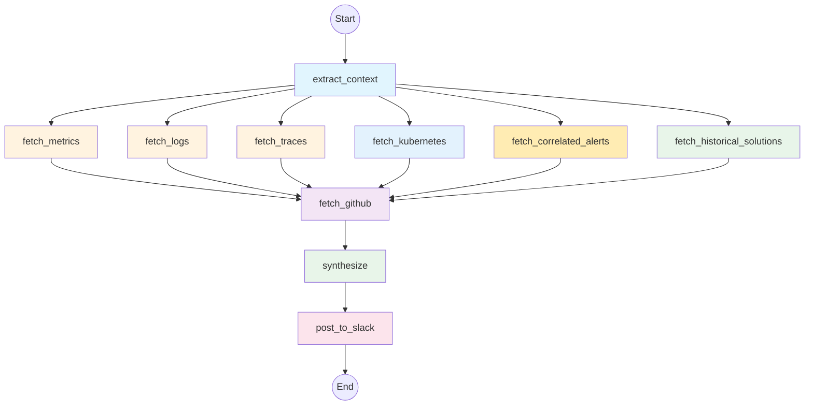

# Architecture

SRE Bot is built as a LangGraph-based agent that orchestrates data collection and analysis through a directed graph workflow.

## Agent Graph

The agent follows this execution flow:



## Workflow Nodes

### 1. Extract Context

Parses the incoming alert and extracts key information:
- Service name
- Namespace/cluster
- Severity level
- Alert description
- Timestamp

### 2. Data Collection (Parallel)

Six nodes run in parallel to gather observability data:

| Node | Source | Data Collected |
|------|--------|----------------|
| `fetch_metrics` | Prometheus | CPU, memory, error rates, latency percentiles |
| `fetch_logs` | Loki | Error logs, fatal logs, log patterns |
| `fetch_traces` | Tempo | Failed traces, slow traces, bottleneck services |
| `fetch_kubernetes` | K8s API | Pod status, events, deployments, container logs |
| `fetch_correlated_alerts` | Alertmanager | Related alerts in time window |
| `fetch_historical_solutions` | Database | Past validated solutions for similar alerts |

### 3. Fetch GitHub

After observability data is collected, fetches recent changes:
- Recent commits on the service repository
- Merged PRs in the last 24 hours
- Latest release information

### 4. Synthesize

The LLM analyzes all collected data and produces:
- **Summary**: Brief description of the incident
- **Probable Root Cause**: Most likely cause based on evidence
- **Contributing Factors**: Additional factors that may have contributed
- **Evidence**: Specific data points supporting the analysis
- **Suggested Actions**: Recommended remediation steps
- **Confidence Level**: High, Medium, or Low
- **Escalation Flag**: Whether human escalation is needed

### 5. Post to Slack

Formats the analysis as a rich Slack message with:
- Block Kit formatting
- Confidence indicators
- Feedback buttons (Correct / Partially Correct / Incorrect)
- Escalation warnings if needed

---

## Project Structure

```
sre-bot/
├── src/sre_bot/
│   ├── agent/                 # LangGraph agent definition
│   │   ├── graph.py          # Graph construction
│   │   ├── state.py          # Pydantic state models
│   │   └── nodes/            # Individual workflow nodes
│   │       ├── extract_context.py
│   │       ├── fetch_metrics.py
│   │       ├── fetch_logs.py
│   │       ├── fetch_traces.py
│   │       ├── fetch_kubernetes.py
│   │       ├── fetch_correlated_alerts.py
│   │       ├── fetch_historical_solutions.py
│   │       ├── fetch_github.py
│   │       ├── synthesize.py
│   │       └── post_to_slack.py
│   │
│   ├── clients/              # External service clients
│   │   ├── prometheus.py     # Prometheus API client
│   │   ├── loki.py          # Loki API client
│   │   ├── tempo.py         # Tempo API client
│   │   ├── kubernetes.py    # Kubernetes API client
│   │   ├── alertmanager.py  # Alertmanager API client
│   │   └── github.py        # GitHub API client
│   │
│   ├── integrations/         # External integrations
│   │   ├── slack.py         # Slack Bolt app
│   │   └── webhook.py       # FastAPI webhook receiver
│   │
│   ├── llm/                  # LLM provider abstraction
│   │   └── factory.py       # Provider factory
│   │
│   ├── queries/              # Query builders
│   │   ├── prometheus.py    # PromQL queries
│   │   ├── loki.py          # LogQL queries
│   │   ├── tempo.py         # TraceQL queries
│   │   └── kube_state_metrics.py
│   │
│   ├── db/                   # Database layer
│   │   ├── models.py        # SQLAlchemy models
│   │   └── repository.py    # Data access layer
│   │
│   ├── config.py            # Settings management
│   └── main.py              # Application entrypoint
│
├── k8s/
│   ├── charts/sre-bot/      # Helm chart
│   └── scripts/             # Setup scripts
│
└── tests/                   # Test suite
```

---

## State Model

The agent uses a Pydantic-based state that flows through all nodes:

```python
class AgentState(BaseModel):
    # Input
    alert: AlertContext
    slack_channel: str | None
    slack_thread_ts: str | None

    # Collected Data
    metrics: MetricsData | None
    logs: LogsData | None
    traces: TracesData | None
    kubernetes: KubernetesData | None
    correlated_alerts: list[CorrelatedAlert]
    historical_solutions: list[HistoricalSolution]
    github_context: GitHubContext | None

    # Output
    analysis: IncidentAnalysis | None
    errors: list[str]
```

---

## Data Flow

```
Alert → State → [Parallel Data Collection] → State → LLM Analysis → State → Slack
         ↓                                     ↓                      ↓
    AlertContext                          All data merged        IncidentAnalysis
                                          into state             generated
```

Each node:
1. Receives the current state
2. Performs its operation (API calls, queries)
3. Returns a partial state update (dict)
4. LangGraph merges updates into the state

---

## Error Handling

- Each data collection node handles its own errors
- Failures are recorded in `state.errors` but don't stop the workflow
- The LLM analysis proceeds with whatever data was successfully collected
- Slack posting includes error information if any nodes failed

---

## Concurrency

- Data collection nodes run in parallel for performance
- `asyncio.gather` with `return_exceptions=True` prevents single failures from blocking others
- Kubernetes pod logs are fetched concurrently (limited to 3 pods)
- Prometheus queries run in parallel within each node
